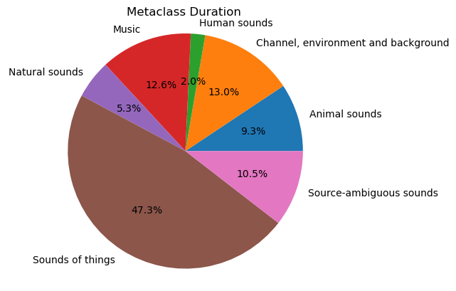

# AudioSet Preprocessing

The aim of this repo is to create a "clean" subset of audioset.
We want to exclude speech and human vocalizations, keep noise segments
with only one type of noise and downsample the music.

To do so, we used the metadata and :
- Excluded segments with multiple labels & downsample music
- Applied pyannote VAD and exclude segments with Voice activity detected

## Create the metadata

If you want to recreate the filtered metadata file, you can use the `main.py` script.

/!\ You need to create a token on Hugging Face to use the `pyannote-vad` model
Create a token on hugging face to use the pyannote-vad model  : https://huggingface.co/pyannote/voice-activity-detection

## Subset repartition

